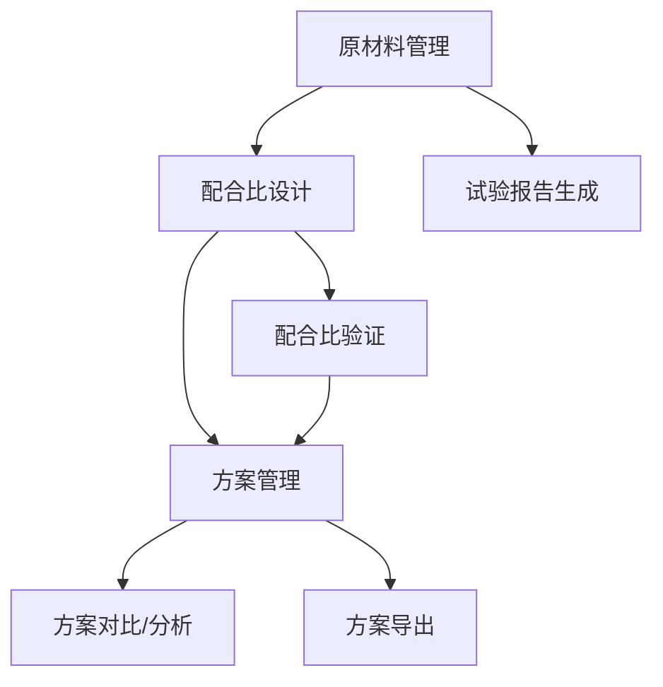

# 混凝土配合比设计软件产品需求文档

## 1. 产品概览

混凝土配合比设计软件是一款专为建筑工程领域设计的专业工具，用于帮助工程技术人员高效、准确地进行混凝土配合比设计和管理。

该产品旨在解决传统配合比设计过程中计算复杂、数据管理混乱、方案复用性差等问题，通过系统化的原材料管理、智能化的配合比计算和规范化的方案管理，提高设计效率和准确性，确保混凝土质量符合工程要求。

产品的目标是成为工程技术人员的必备工具，为混凝土配合比设计提供全面的解决方案，适用于各类建筑工程、水利工程、交通工程等领域。

## 2. 核心功能

### 2.1 功能模块

我们的混凝土配合比设计软件包含以下主要页面：

1. **原材料管理页面**：管理各类原材料信息，包括水泥、骨料、外加剂等，支持增加、删除、编辑和试验报告输出。
2. **配合比设计页面**：基于原材料性能参数，进行配合比计算和优化。
3. **方案管理页面**：保存、管理和复用配合比设计方案。
4. **系统设置页面**：配置系统参数和用户偏好。

### 2.2 页面详情

| 页面名称 | 模块名称 | 功能描述 |
|-----------|-------------|---------------------|
| 原材料管理页面 | 原材料列表 | 展示所有原材料的基本信息，包括名称、类型、规格等。支持按类型筛选和搜索功能。 |
| 原材料管理页面 | 原材料详情 | 显示单个原材料的详细信息，包括物理性能、化学性能等试验数据。 |
| 原材料管理页面 | 原材料编辑 | 支持增加新原材料、编辑现有原材料信息、删除不需要的原材料。 |
| 原材料管理页面 | 试验报告 | 根据原材料试验数据生成标准格式的试验报告，支持PDF导出。 |
| 配合比设计页面 | 设计参数设置 | 设置设计目标，如强度等级、坍落度、环境类别等。 |
| 配合比设计页面 | 原材料选择 | 从已有的原材料库中选择用于配合比设计的原材料。 |
| 配合比设计页面 | 配合比计算 | 根据原材料性能和设计参数，自动计算配合比。 |
| 配合比设计页面 | 配合比优化 | 基于计算结果，提供优化建议，如成本优化、性能优化等。 |
| 配合比设计页面 | 配合比验证 | 验证计算出的配合比是否满足各项技术要求。 |
| 方案管理页面 | 方案列表 | 展示所有保存的配合比设计方案，支持按项目、强度等级等筛选。 |
| 方案管理页面 | 方案详情 | 显示单个配合比方案的详细信息，包括原材料用量、性能指标等。 |
| 方案管理页面 | 方案操作 | 支持方案的创建、编辑、删除、复制和导出功能。 |
| 方案管理页面 | 方案对比 | 支持多个配合比方案的对比分析，帮助用户选择最优方案。 |
| 系统设置页面 | 用户管理 | 管理系统用户，包括添加、编辑、删除用户，设置用户权限。 |
| 系统设置页面 | 系统参数 | 配置系统默认参数，如常用强度等级、单位转换系数等。 |
| 系统设置页面 | 报告模板 | 管理试验报告和配合比方案报告的模板。 |

## 3. Core Process

### 主要用户操作流程

**流程1：原材料管理流程**
1. 用户进入原材料管理页面
2. 浏览现有原材料列表
3. 点击"添加"按钮，填写原材料信息
4. 上传试验数据或手动输入
5. 保存原材料信息
6. 可选择生成试验报告并导出

**流程2：配合比设计流程**
1. 用户进入配合比设计页面
2. 设置设计目标参数（强度等级、坍落度等）
3. 从原材料库中选择所需原材料
4. 系统自动计算初始配合比
5. 用户可根据需要调整配合比参数
6. 系统验证配合比是否满足要求
7. 保存设计方案或导出报告

**流程3：方案管理流程**
1. 用户进入方案管理页面
2. 浏览现有方案列表
3. 点击方案查看详情
4. 可选择编辑、复制、删除方案
5. 可选择多个方案进行对比分析
6. 可导出方案报告

## 4. 用户接口设计

### 4.1 设计风格

- **主色和辅色**：使用专业、稳重的蓝色作为主色调（#1E88E5），搭配灰色（#757575）作为辅助色，白色（#FFFFFF）作为背景色，确保界面清晰、专业。

- **按钮样式**：采用圆角矩形按钮，主要操作按钮使用主色调填充，次要操作使用边框样式，悬停时有轻微阴影效果。

- **字体**：使用无衬线字体（如微软雅黑、Arial），标题采用16-18px，正文采用14px，确保可读性。

- **布局样式**：采用左侧固定导航栏，右侧内容区的布局方式，响应式设计，适配不同屏幕尺寸。

- **图标样式**：使用简洁、直观的线性图标，保持风格一致。

### 4.2 页面设计概览

| 页面名称 | 模块名称 | UI元素 |
|-----------|-------------|-------------|
| 原材料管理页面 | 原材料列表 | 表格形式展示原材料信息，包含名称、类型、规格、状态等列，支持排序和筛选。顶部有添加、导入、导出按钮。 |
| 原材料管理页面 | 原材料编辑 | 表单形式，包含基本信息、物理性能、化学性能等标签页，使用输入框、下拉菜单、文件上传等控件。 |
| 原材料管理页面 | 试验报告 | 标准格式的报告预览，包含原材料信息、试验数据、结论等部分，支持PDF导出按钮。 |
| 配合比设计页面 | 设计参数设置 | 表单形式，包含强度等级、坍落度、环境类别等参数的输入和选择控件。 |
| 配合比设计页面 | 原材料选择 | 下拉选择框或多选列表，从原材料库中选择水泥、骨料、外加剂等。 |
| 配合比设计页面 | 配合比计算 | 计算结果以表格形式展示，包含各原材料用量、水灰比、砂率等参数。 |
| 配合比设计页面 | 配合比优化 | 优化建议以卡片形式展示，包含成本优化、性能优化等选项。 |
| 方案管理页面 | 方案列表 | 卡片或表格形式展示方案信息，包含方案名称、强度等级、创建日期等，支持筛选和搜索。 |
| 方案管理页面 | 方案详情 | 详细的方案信息展示，包含原材料用量、性能指标、计算过程等，支持编辑和导出。 |
| 系统设置页面 | 用户管理 | 表格形式展示用户信息，包含用户名、角色、权限等，支持添加、编辑、删除操作。 |

### 4.3 自适应

产品采用响应式设计，适配桌面端和平板设备。在小屏幕设备上，导航栏将折叠为汉堡菜单，内容布局将调整为单列显示，确保在不同设备上都能良好展示和操作。

## 5. 功能需求（Functional Requirements）

| 编号 | 功能点 | 用户故事/缘由说明 | 输入/输出/流程 | 详细说明 | 优先级 |
|------|----------|------------------------|----------------------|------------------------|----------|
| FR1 | 原材料管理 | 作为工程技术人员，我需要管理各类原材料信息，以便在配合比设计时选择合适的原材料。 | 输入：原材料基本信息、试验数据 输出：原材料列表、详细信息 流程：添加/编辑/删除原材料 | 支持水泥、骨料、外加剂等多种原材料类型的管理，记录详细的物理和化学性能指标，支持试验数据的上传和管理。 | 高 |
| FR2 | 原材料试验报告 | 作为工程技术人员，我需要根据原材料试验数据生成标准格式的试验报告，以便存档和提交。 | 输入：原材料信息、试验数据 输出：PDF格式试验报告 流程：选择原材料→生成报告→导出 | 基于原材料的试验数据，生成符合行业标准的试验报告，支持PDF格式导出，包含原材料基本信息、试验方法、试验结果、结论等内容。 | 高 |
| FR3 | 配合比设计参数设置 | 作为工程技术人员，我需要设置配合比设计的目标参数，以便系统能够根据这些参数进行计算。 | 输入：强度等级、坍落度、环境类别等参数 输出：设置完成的参数 流程：填写参数→验证→保存 | 支持设置混凝土强度等级、坍落度、环境类别、耐久性要求等设计参数，提供常用参数的快速选择。 | 高 |
| FR4 | 原材料选择 | 作为工程技术人员，我需要从原材料库中选择用于配合比设计的原材料，以便系统能够基于实际原材料性能进行计算。 | 输入：选择的原材料 输出：原材料选择结果 流程：浏览原材料→选择→确认 | 从已有的原材料库中选择水泥、骨料、外加剂等用于配合比设计，支持按类型、规格等条件筛选。 | 高 |
| FR5 | 配合比计算 | 作为工程技术人员，我需要系统根据原材料性能和设计参数自动计算配合比，以提高设计效率和准确性。 | 输入：设计参数、原材料信息 输出：配合比计算结果 流程：设置参数→选择原材料→计算 | 根据国家或行业标准，基于原材料性能和设计参数，自动计算混凝土配合比，包括各原材料的用量、水灰比、砂率等。 | 高 |
| FR6 | 配合比优化 | 作为工程技术人员，我需要系统提供配合比优化建议，以便在满足性能要求的同时降低成本。 | 输入：初始配合比 输出：优化建议 流程：计算配合比→生成优化建议→应用优化 | 基于初始配合比，提供成本优化、性能优化等建议，允许用户根据实际需求选择优化方向。 | 中 |
| FR7 | 配合比验证 | 作为工程技术人员，我需要系统验证计算出的配合比是否满足各项技术要求，以确保混凝土质量。 | 输入：配合比计算结果 输出：验证结果 流程：计算配合比→验证→显示结果 | 验证配合比是否满足强度、耐久性、工作性等要求，提供验证报告和改进建议。 | 高 |
| FR8 | 方案管理 | 作为工程技术人员，我需要保存和管理配合比设计方案，以便后续查阅和复用。 | 输入：配合比方案 输出：方案列表、详情 流程：设计配合比→保存方案→管理方案 | 支持配合比方案的创建、保存、编辑、删除、复制等操作，可按项目、强度等级等条件筛选和搜索。 | 高 |
| FR9 | 方案对比 | 作为工程技术人员，我需要对比多个配合比方案，以便选择最优方案。 | 输入：选择的方案 输出：对比结果 流程：选择方案→对比→分析 | 支持多个配合比方案的对比分析，展示各方案的原材料用量、成本、性能指标等差异，帮助用户做出决策。 | 中 |
| FR10 | 方案导出 | 作为工程技术人员，我需要导出配合比方案报告，以便提交给相关方或存档。 | 输入：配合比方案 输出：PDF格式方案报告 流程：选择方案→导出报告 | 生成符合行业标准的配合比方案报告，支持PDF格式导出，包含方案详情、计算过程、验证结果等内容。 | 高 |
| FR11 | 用户管理 | 作为系统管理员，我需要管理系统用户，以便控制用户权限和确保系统安全。 | 输入：用户信息、权限设置 输出：用户列表、权限分配 流程：添加/编辑/删除用户→设置权限 | 支持添加、编辑、删除用户，设置用户角色和权限，确保不同用户只能访问授权的功能。 | 中 |
| FR12 | 系统参数设置 | 作为系统管理员，我需要配置系统默认参数，以便系统能够更好地适应不同的使用场景。 | 输入：系统参数 输出：更新后的参数 流程：修改参数→保存 | 配置系统默认参数，如常用强度等级、单位转换系数、报告模板等，提高系统的灵活性和适用性。 | 中 |

## 6. 非功能需求（Non-Functional Requirements）

| 编号 | 需求点 | 详细说明 | 优先级 |
|------|----------|------------------------|----------|
| NFR1 | 性能要求 | 系统响应时间应控制在2秒以内，配合比计算时间应控制在5秒以内，确保用户操作流畅。 | 高 |
| NFR2 | 可靠性 | 系统应具有良好的稳定性，避免崩溃和数据丢失，重要操作应提供确认机制。 | 高 |
| NFR3 | 安全性 | 系统应采用密码加密存储，用户权限分级管理，防止未授权访问和数据泄露。 | 高 |
| NFR4 | 可扩展性 | 系统应具备良好的可扩展性，支持未来功能的添加和现有功能的升级。 | 中 |
| NFR5 | 易用性 | 系统界面应简洁明了，操作流程应符合用户习惯，提供必要的提示和帮助信息。 | 高 |
| NFR6 | 兼容性 | 系统应兼容主流浏览器（Chrome、Firefox、Edge等），支持Windows和Mac操作系统。 | 中 |
| NFR7 | 数据备份 | 系统应提供自动数据备份功能，定期备份用户数据，防止数据丢失。 | 中 |
| NFR8 | 国际化 | 系统应支持多语言，至少包括中文和英文，以满足不同用户的需求。 | 低 |

## 7. 数据需求

| 编号 | 数据点 | 数据结构 | 存储方式 | 优先级 |
|------|----------|------------------------|------------------------|----------|
| DR1 | 原材料数据 | 包含原材料ID、名称、类型、规格、生产厂家、物理性能、化学性能、试验数据等字段。 | 关系型数据库 | 高 |
| DR2 | 配合比方案数据 | 包含方案ID、名称、创建日期、设计参数、原材料用量、计算结果、验证结果等字段。 | 关系型数据库 | 高 |
| DR3 | 用户数据 | 包含用户ID、用户名、密码、角色、权限等字段。 | 关系型数据库 | 中 |
| DR4 | 系统参数数据 | 包含参数ID、参数名称、参数值、描述等字段。 | 关系型数据库 | 中 |
| DR5 | 试验报告模板 | 包含模板ID、模板名称、模板内容等字段。 | 文件系统 | 中 |
| DR6 | 配合比方案报告模板 | 包含模板ID、模板名称、模板内容等字段。 | 文件系统 | 中 |

## 8. 范围限定

| 编号 | 边界/范围限定 | 说明 | 范围限定类型 |
|------|----------|------------------------|------------------------|
| SC1 | 配合比设计标准 | 系统基于国家或行业标准进行配合比计算，不支持自定义计算方法。 | 功能范围 |
| SC2 | 原材料类型 | 系统支持水泥、骨料、外加剂等常见原材料类型，不支持特殊原材料的管理。 | 功能范围 |
| SC3 | 计算精度 | 配合比计算结果保留两位小数，满足工程设计要求。 | 技术限制 |
| SC4 | 数据存储 | 系统数据存储在本地或局域网服务器，不支持云存储。 | 技术限制 |
| SC5 | 用户数量 | 系统支持最多100个用户同时使用。 | 性能限制 |

## 9. 验收标准（Acceptance Criteria）

| 编号 | 关联需求 | 验收说明 | 测试方法 |
|------|----------|------------------------|------------------------|
| AC1 | FR1 | 能够成功添加、编辑、删除原材料信息，原材料列表显示正确。 | 功能测试 |
| AC2 | FR2 | 能够基于原材料试验数据生成标准格式的试验报告，支持PDF导出。 | 功能测试 |
| AC3 | FR3, FR4, FR5 | 能够设置设计参数，选择原材料，系统自动计算配合比。 | 功能测试 |
| AC4 | FR6, FR7 | 系统能够提供配合比优化建议，并验证配合比是否满足要求。 | 功能测试 |
| AC5 | FR8, FR9, FR10 | 能够保存、管理、对比配合比方案，支持方案导出。 | 功能测试 |
| AC6 | FR11, FR12 | 能够管理用户和系统参数，权限控制有效。 | 功能测试 |
| AC7 | NFR1 | 系统响应时间不超过2秒，配合比计算时间不超过5秒。 | 性能测试 |
| AC8 | NFR2, NFR3 | 系统运行稳定，数据安全，未授权用户无法访问受限功能。 | 安全测试 |
| AC9 | NFR5 | 系统界面友好，操作流程清晰，提供必要的提示和帮助信息。 | 用户体验测试 |
| AC10 | NFR6 | 系统在主流浏览器和操作系统上运行正常。 | 兼容性测试 |

## 10. 风险/依赖备注区

| 类型     | 关联编号/功能点 | 具体内容/说明                          | 备注      |
| :----- | :------- | :------------------------------- | :------ |
| 风险点    | FR5/配合比计算 | 不同地区或项目可能采用不同的配合比计算标准，系统默认标准可能不适用所有场景。 | 建议提供标准选择功能，允许用户选择适用的计算标准。 |
| 风险点    | FR2/试验报告 | 不同行业或地区对试验报告格式可能有不同要求，系统默认模板可能不满足所有需求。 | 建议提供报告模板自定义功能，允许用户根据需要修改模板。 |
| 依赖项    | FR5/配合比计算 | 配合比计算依赖于准确的原材料性能数据，数据不准确可能导致计算结果偏差。 | 建议在系统中添加数据验证功能，提示用户检查数据准确性。 |
| 依赖项    | DR1/原材料数据 | 原材料数据的完整性和准确性直接影响配合比设计结果。 | 建议提供数据导入功能，支持从试验设备或其他系统导入数据。 |
| 风险点    | NFR3/安全性 | 系统可能存储敏感的工程数据，需要确保数据安全。 | 建议加强数据加密和访问控制措施。 |
| 依赖项    | NFR7/数据备份 | 数据备份依赖于用户的备份操作，用户可能忘记备份导致数据丢失。 | 建议实现自动备份功能，定期自动备份数据。 |

## 11. 版本规划

### 11.1 MVP版本（v1.0）

**核心功能**：
- 原材料管理（基本的添加、编辑、删除功能）
- 配合比设计（基于标准的配合比计算）
- 方案管理（基本的保存、查看、删除功能）
- 简单的试验报告生成

**目标**：实现混凝土配合比设计的核心功能，满足基本的设计需求。

**预计发布时间**：3个月

### 11.2 v1.1版本

**新增功能**：
- 原材料试验报告模板自定义
- 配合比优化建议
- 方案对比功能
- 数据导入/导出功能

**目标**：增强系统功能，提高设计效率和用户体验。

**预计发布时间**：MVP版本发布后2个月

### 11.3 v1.2版本

**新增功能**：
- 用户管理和权限控制
- 系统参数设置
- 多语言支持
- 自动数据备份

**目标**：完善系统功能，提高系统安全性和可靠性。

**预计发布时间**：v1.1版本发布后2个月

### 11.4 v2.0版本

**新增功能**：
- 云存储和多设备同步
- 高级配合比优化算法
- 智能原材料推荐
- 与其他工程软件的集成

**目标**：实现系统的全面升级，提供更高级的功能和更好的用户体验。

**预计发布时间**：v1.2版本发布后3个月

## 12. 总结

混凝土配合比设计软件是一款专为工程技术人员设计的专业工具，通过系统化的原材料管理、智能化的配合比计算和规范化的方案管理，提高设计效率和准确性，确保混凝土质量符合工程要求。

本产品需求文档详细描述了产品的核心功能、用户界面设计、功能需求、非功能需求、数据需求等内容，为产品开发提供了明确的指导。通过分阶段的版本规划，确保产品能够逐步完善，满足用户的需求。

产品的成功实施将为混凝土配合比设计工作带来显著的效率提升和质量保证，成为工程技术人员的得力助手。